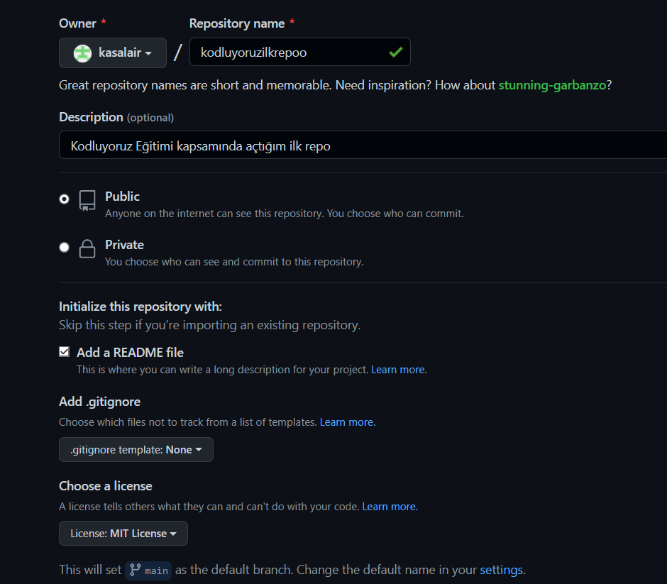

# Kodluyoruz İlk Repo
Bu repo Kodluyoruz Eğitiminde oluşturduğumuz ilk repo. İçerisinde bir adet README dosyası, bir adet de index.html barındırıyor.

## Installation
git clone https://github.com/kasalair/kodluyoruzilkrepo.git
## Usage

## Contribution
Pull requestler kabul edilir. Büyük değişiklikler için, lütfen önce neyi değiştirmek istediğinizi tartışmak için bir konu açınız.
## License
[MIT](https://choosealicense.com/licenses/mit/)

## Website
[Patika](www.patika.dev)